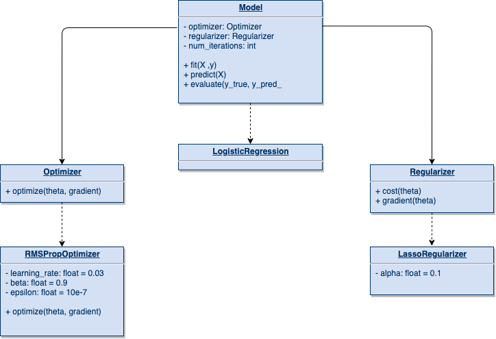

# Basics of AI - implementations of ML models and optimization methods

This project is an implementation of the logistic regression model as well as optimization and regularization methods/algorithms using `python` and `numpy` libraries, with practical examples and explanations to better present the concepts.

All results of our models are going to be compared with the ready implementations found in the `sklearn` library.


### Introduction
**Logistic regression**, despite its name, is a linear model for classification rather than regression.
Logistic regression is also often called *logit regression* because it uses a logistic function to predict the results.
LR is a probabilistic model that assigns the probability of a sample to a given class.
You can find more about linear regression [here](https://en.wikipedia.org/wiki/Logistic_regression).


### Interface
Our models provide a clean interface based on the `sklearn` library interface.
In addition to the models themselves, various regularizers and optimization algorithms are available.



More details can be found inside the [docs](./docs/docs.md).

#### Basic Example
```python
model = LogisticRegression()

model.fit(X_train, y_train)
y_pred = model.predict(X_test)
score = model.evaluate(y_test, y_pred)
```
You examples can be found inside the [examples section :fire:](./src).


### Credits
* *images:* https://www.equiskill.com/
