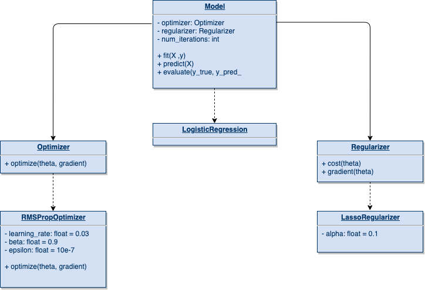

#### Available Models
1. `Logistic Regression`

#### Regularizers
1. `LassoRegularizer`
2. `RidgeRegularizer`
3. `ElasticNetRegularizer`

#### Optimizers
1. `GradientDescentOptimizer`
2. `MomentumGradientDescentOptimizer`
3. `AdaGradOptimizer`
4. `RMSPropOptimizer`
5. `AdamOptimizer`

#### Interface



#### 1. Logistic Regression
Logistic Regression is a generalized linear model which means that the result of the prediction is a linear combination of the features:

<a href="https://www.codecogs.com/eqnedit.php?latex=\hat&space;y&space;(\theta,&space;x)&space;=&space;\theta_0&space;&plus;&space;\theta_1&space;x_1&space;&plus;&space;\ldots&space;&plus;&space;\theta_n&space;x_n" target="_blank"></a>


**Logistic regression**, despite its name, is a linear model for classification rather than regression.
Logistic regression is also often called *logit regression* because it uses a logistic function to predict the results.
LR is a probabilistic model that assigns the probability of the sample to a given class.
You can find more about linear regression [here](https://en.wikipedia.org/wiki/Logistic_regression).

Logistic regression is implemented in `LogisticRegression`. This implementation support any solving algorithms with additionally L1, L2
or Elastic-Net regularization. Additionally, in `LinearRegression` model, you can fit intercept if bias should be added to the decision function.


### Logit vs. probit models

Each logit and probit model is used to predict binary variables ex. *yes* or *no*. Both of these models provides fitting a nonlinear function to the training data - they do it in such a way that it is possible to match a certain decision line.
Usually logi and probil models scale function values in some way to a range between 0 and 1, which may correspond to the probability of the object belonging to a given class.

In fact, any function that scales values from 0 to 1 could be used here, but the use of the probit and logit functions involves dependencies on the probability distribution of a certain feature.

Without going into detail, probit and logit models transform a function from a linear into a nonlinear one.

* Function before transformation: *y = ax + b*,
* Function after nonlinear transform: *y = f(ax + b)*.

The main difference between the two models is the way the *f* function is defined:
> The logit model uses something called the cumulative distribution function of the logistic distribution.

> The probit model uses something called the cumulative distribution function of the standard normal distribution to define *f(∗)*

Logit function has slightly flatter tails, while the probit curve will move closer to the axis faster.


**Which one is better?** 

We use the logit function when implementing logistic regression, the probit function is applicable to other models.

The use of logit and probit is associated with the subsequent application of the model, for example, we use logit for medical data, where the coefficients can be interpreted in terms of odds ratios. However, we will use probit in models used in economics.

It all depends on the situation for which the model is to be used. Many sources have divergent views on which one is better - it all depends on the specific situation.


Credits: 
* https://tutorials.methodsconsultants.com/posts/what-is-the-difference-between-logit-and-probit-models/
* https://assets.datacamp.com/production/repositories/2698/datasets/7d991dbeee8e40eb7b0d23398d7861f00e813620/probitVsLogit.jpg


##### 1.1 Parameters
| Parameter        | Description           | Default value  | type |
| ------------- |:-------------:| -----:| ----:|
| `optimizer`      | Optimization algorithm wich is used to optimize model cost. | `AdamOptimizer()` | `Optimizer`  |
| `regularizer`      | Regularization algorithm which is used to limit the models cost function.      |   `RidgeRegularizer()` | `Regularizer` |
| `num_iterations` | Number of iterations for the optimization algorithm.      |    `300` | `int` |
| `threshold` | Logistic regression decision threshold. | `0.5` | `float` |
| `fit_intercept` | Specifies if a constant (a.k.a. bias or intercept) should be added to the decision function | `True` | `bool` |
| `verbose` | Verbosity during optimization. | `False` | `bool` |


By default `LogisticRegression` has **ridge** regularization (L2, with alpha=0.1), default `AdamOptimizer` as a solving algorithm.

##### 1.2 Attributes

| Attribute        | Description           | Default value  | type |
| ------------- |:-------------:| -----:| ----:|
| `theta` | Coefficient of the X (features) in logistic regression. | `np.zeros(X.shape[1])` | `np.ndarray`
 

##### 1.3 Examples of usage
```python
from core.models import LogisticRegression
from core import optimizers
from core import regularizers

l1 = LassoRegularizer(alpha=0.15)
momentum = MomentumGradientDescentOptimizer()

model = LogisticRegression(regularizer=l1, optimizer=momentum, num_iterations=500)
model.fit(X_train, y_train)
```

#### 2. Regularizers

> "**Regularization** is the process of adding information in order to solve an ill-posed problem or to prevent overfitting."
[Read more](https://en.wikipedia.org/wiki/Regularization_(mathematics))

In machine learning models, we want to avoid the **overfitting** - a good way to reduce the doomed to overtraining a model is its regularization.

The idea of regularization is to add an additional cost to the objective function that penalizes the model overfitting. 

Our implementation provides 3 types of regularizers:
1. `LassoRegularizer`
2. `RidgeRegularizer`
3. `ElasticNetRegularizer`


#### 2.1 `LassoRegularizer`
Regularizer L1 (Lasso Regularizer) limits the model's cost and gradient functions. 
The lasso regularization thus acts as a feature selection mechanism. He gradually rejects the linear attributes and leaves the set of the most important ones.
[Read more](https://en.wikipedia.org/wiki/Regularization_(mathematics))

Parameters:
* `alpha: np.float = 0.1` - alpha is the L1 regularization factor.

Example of usage:
```python
>>> regularizer = RegularizerL1()
>>> regularizer.cost(theta)
[ 1.2 3.1 1.0 -1.8 ]
>>> regularizer.gradient(theta)
[ 0.2 4.1 1.3 -2.4 ]
```

#### 2.2 `RidgeRegularizer`
Regularizer L2 (Ridge Regularizer) limits the model's cost and gradient functions. Ridge regularization means that we do not eliminate non-essential features but rather minimize their impact on the trained model.
[Read more](https://en.wikipedia.org/wiki/Regularization_(mathematics))

Parameters:
* `alpha: np.float = 0.1` - alpha is the L2 regularization factor.

Example of usage:
```python
>>> regularizer = RegularizerL2()
>>> regularizer.cost(theta)
[ 1.2 3.1 1.0 -1.8 ]
>>> regularizer.gradient(theta)
[ 0.2 4.1 1.3 -2.4 ]
```

#### 2.3 `ElasticNetRegularizer`
ElasticNetRegularizer combines L1 and L2 regularizers; it is used to limit the model's cost and gradient. In this case, the regularization factor is formed by a simple combination of the terms of both of the techniques mentioned.
[Read more](https://en.wikipedia.org/wiki/Regularization_(mathematics))

Parameters:
* `alpha: np.float = 0.1` - alpha is L1 the regularization factor.
* `beta: np.float = 0.1` - beta is L2 the regularization factor.
* `gamma: np.float = 0.8` -  gamma is the mixing parameter between ridge and lasso.

Example of usage:
```python
>>> regularizer = ElasticNetRegularizer()
>>> regularizer.cost(theta)
[ 1.2 3.1 1.0 -1.8 ]
>>> regularizer.gradient(theta)
[ 0.2 4.1 1.3 -2.4 ]
```


#### 3. Optimizers

We use a method called **gradient descent** to train our model. This method iteratively reduces the cost function.

From a mathematical point of view, the gradient is the direction in which the function grows the most. It turns out that the opposite direction to the gradient indicates the place where the local minimum of the function can be.

This means that iteratively moving in the opposite direction to the function gradient, and we are able to find the cost function's local minimum.

<a href="https://www.codecogs.com/eqnedit.php?latex=\theta'&space;=&space;\theta&space;-&space;\mu&space;\nabla&space;f" target="_blank"></a>

**Optimizers** are algorithms responsible for reducing the cost function during the gradient descent algorithm. 

They tie together the loss function and model parameters by updating the model in response to the loss function's output.


Our implementation provides 5 types of optimizers:

1. `GradientDescentOptimizer`
2. `MomentumGradientDescentOptimizer`
3. `AdaGradOptimizer`
4. `RMSPropOptimizer`
5. `AdamOptimizer`

The basic difference in these algorithms' operation consists of their ability to bypass places where the cost function is not very variable. They can find the optimum faster than the basic gradient descent algorithm.

##### 3.1 `GradientDescentOptimizer`
Gradient descent is a first-order iterative optimization algorithm for finding a local minimum of a differentiable function. [Read more](https://en.wikipedia.org/wiki/Gradient_descent)

Parameters:
* `learning_rate: np.float = 0.03` - Learning rate parameter used in optimizer function.

Example of usage:
```python
>>> optimizer = GradientDescentOptimizer()
>>> optimizer.optimize(theta, gradient)
[ 1.2 3.1 1.0 -1.8 ]
```

##### 3.2 `MomentumGradientDescentOptimizer`
Momentum is a method that helps accelerate SGD in the relevant direction and dampens oscillations. [Read more](https://ml-cheatsheet.readthedocs.io/en/latest/optimizers.html#momentum)

Parameters:
* `learning_rate: np.float = 0.03` - Learning rate parameter used in optimizer function.
* `momentum_rate: np.float = 0.9` - Momentum rate parameter used in momentum  Number of iterations for the optimization algorithm.  algorithm. Momentum rate must be from interval from 0 to 1.

Example of usage:
```python
>>> optimizer = MomentumGradientDescentOptimizer()
>>> optimizer.optimize(theta, gradient)
[ 1.2 3.1 1.0 -1.8 ]
```

##### 3.3 `AdaGradOptimizer`
Adagrad is an optimizer with parameter-specific learning rates adapted relative to how frequently a parameter gets updated during training. The more updates a parameter receives, the smaller the updates. [Read more](https://ml-cheatsheet.readthedocs.io/en/latest/optimizers.html#adagrad)

Parameters:
* `learning_rate: np.float = 0.03` - Learning rate parameter used in optimizer function.
* `epsilon: np.float = 1e-7` - Epsilon is the small ceoffiecent used to avoid dividing by 0.

Example of usage:
```python
>>> optimizer = AdaGradOptimizer()
>>> optimizer.optimize(theta, gradient)
[ 1.2 3.1 1.0 -1.8 ]
```

##### 3.4 `RMSPropOptimizer`
RMS Prop Optimizer is another algorithm that adapts to the data.
[Read more](https://ml-cheatsheet.readthedocs.io/en/latest/optimizers.html#rmsprop)

Parameters:
* `learning_rate: np.float = 0.03` - Learning rate parameter used in optimizer function.
* `beta: np.float = 0.09` - Hyperparameter responsible for introducing the exponential distribution at the first stage of learning.
* `epsilon: np.float = 1e-7` - Epsilon is the small ceoffiecent used to avoid dividing by 0.

Example of usage:
```python
>>> optimizer = RMSPropOptimizer()
>>> optimizer.optimize(theta, gradient)
[ 1.2 3.1 1.0 -1.8 ]
```

##### 3.5 `AdamOptimizer`
Adam is an adaptive learning rate optimization algorithm designed specifically for training deep neural networks. [Read more](https://ml-cheatsheet.readthedocs.io/en/latest/optimizers.html#adam)

Parameters:
* `learning_rate: np.float = 0.03` - Learning rate parameter used in optimizer function.
* `beta1: np.float = 0.9` - "The exponential decay rate for the first moment estimates". [Credits](https://machinelearningmastery.com/adam-optimization-algorithm-for-deep-learning/)
* `beta2: np.float = 0.999` - "The exponential decay rate for the second-moment estimates". [Credits](https://machinelearningmastery.com/adam-optimization-algorithm-for-deep-learning/)
* `epsilon: np.float = 1e-7` - Epsilon is the small ceoffiecent used to avoid dividing by 0.


Example of usage:
```python
>>> optimizer = AdamOptimizer()
>>> optimizer.optimize(theta, gradient)
[ 1.2 3.1 1.0 -1.8 ]
```
