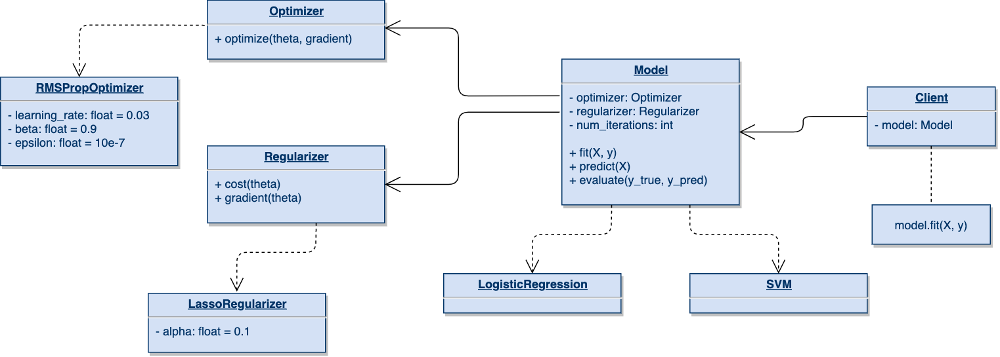

#### Available Models
1. `Logistic Regression`
2. `SVM`

#### Regularizers
1. `LassoRegularizer`
2. `RidgeRegularizer`
3. `ElasticNetRegularizer`

#### Optimizers
1. `GradientDescentOptimizer`
2. `MomentumGradientDescentOptimizer`
3. `AdaGradOptimizer`
4. `RMSPropOptimizer`
5. `AdamOptimizer`

#### Interface



#### 1. Logistic Regression
Logistic Regression is generalized linear model which means that the result of the prediction is linear combination of the features:

$$\hat y (\theta, x) = \theta_0 + \theta_1 x_1 + \ldots + \theta_n x_n$$


**Logistic regression**, despite its name, is a linear model for classification rather than regression.
Logistic regression is also often called *logit regression* because it uses a logistic function to predict the results.
LR is a propabilistic model that assigns the probability of a sample to a given class.
You can find more about linear regression [here](https://en.wikipedia.org/wiki/Logistic_regression).

Logistic regression is implemented in `LogisticRegression`. This implementation support any solving algorithms with additional L1, L2
or Elastic-Net regularization. Additionally in `LinearRegression` model, you can fit intercept - if bias should be added to the decision function.

##### 1.1 Parameters
| Parameter        | Description           | Default value  | type |
| ------------- |:-------------:| -----:| ----:|
| `optimizer`      | Optimizer algorithm wich is used to optimize model cost. | `AdamOptimizer()` | `Optimizer`  |
| `regularizer`      | Regularization algorithm which is used to limit the models cost function.      |   `RidgeRegularizer()` | `Regularizer` |
| `num_iterations` | Number of iterations for the optimizer algorithm..      |    `300` | `int` |
| `threshold` | Logistic regression decision threshold. | `0.5` | `float` |
| `fit_intercept` | Specifies if a constant (a.k.a. bias or intercept) should be added to the decision function | `True` | `bool` |
| `verbose` | Verbosity during optimization. | `False` | `bool` |


By default `LogisticRegression` has **ridge** regularization (L2, with $\alpha=0.1$), default `AdamOptimizer` as a solving algorithm.

##### 1.2 Attributes
 

##### 1.3 Examples of usage
```python
from core.models import LogisticRegression
from core import optimizers
from core import regularizers

l1 = LassoRegularizer(alpha=0.15)
momentum = MomentumGradientDescentOptimizer()

model = LogisticRegression(regularizer=l1, optimizer=momentum, num_iterations=500)
model.fit(X_train, y_train)
```

  